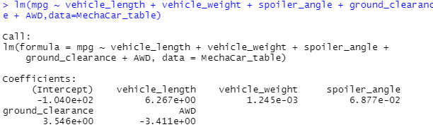
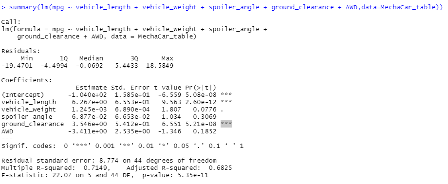
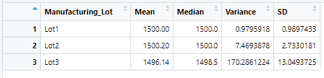
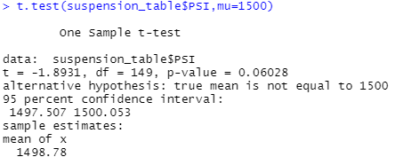
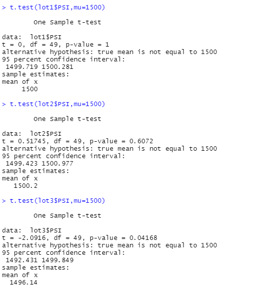

# MechaCar_Statistical_Analysis
## Linear Regression to Predict MPG
In this study, we are trying to analyze the linear regression between the mpg and rest of the factors, including: vehicle length, vehicle width, ground clearance, AWD and spoiler angle. 
  After reading in the MechaCar data, and performing linear model function to the dataset, we have following findings:

  By further performing summary() function to the linear model, we have following results:

- Which variables/coefficients provided a non-random amount of variance to the mpg values in the dataset?
 From the summary, we can tell the p-value of <strong>ground clearance and vehicle length</strong> provided significant contribution to the mpg value. 
 In addition, intercept also shows its significance level towards the mpg value, which means there may be other factors that can contribute to the mpg value, or simply just means transformation and scaling between the ground clearance and the vehicle length.

- Is the slope of the linear model considered to be zero? Why or why not?
  By performing the linear regression analysis, we are conducting a hypothesis testing on whether there's relationship between independent variables and dependent variable. Here're the hypothese for the testing:
  H0 : The slope of the linear model is zero, or m = 0
  Ha : The slope of the linear model is not zero, or m ≠ 0
  According to the results, the p-value of the linear model is 5.35e-11, significantly smaller than 5%. So we can reject the null H0, and <strong>conclude that the slope of the linear model is not zero. </strong>

- Does this linear model predict mpg of MechaCar prototypes effectively? Why or why not?
 Yes, not only the p-value of the linear model shows the significance level, but also the linear model's multiple R-squared is 0.7149, which means that 72% of the variability of the dependent variable is explained using the linear model.  

## Summary Statistics on Suspension Coils
Here's the total summary of the suspension coil.

Here's the summary of the suspension coil by lot.

  After breaking down the Suspension Coil table, we can see the overall variance of the suspension coil is 62.3, which meets the standard of below 100 pounds per square inch. However, if we break down the data by lot, we can see lot 1 and lot 2 has very limited variance while lot 3 has significantly high variance of 170, which doesn't meet the standard of the design specification.

## T-Tests on Suspension Coils
### PSI across all manufacturing lots
When comparing PSI across all manufacturing lots with the population mean of 1,500 pounds per square inch, we assume the following hypothese:
  H0 : There is no statistical difference between the observed sample mean and its presumed population mean.
  Ha : There is a statistical difference between the observed sample mean and its presumed population mean.
  Here's the result of performing t-test on the overall manufacturing lots:

  From the result, we can see the p-value is 0.0628, greater than 0.05. So there's no sufficient evidence to reject the null hypothese. So <strong>there's no statistical difference between the overall manufacturing lot and the population mean of 1,500 pounds per square inch.</strong>

### PSI for each manufacturing lot
Following the same approach of overall manufacturing lots analysis, here're the results of performing t-test on individual manufacturing lot : Lot1, Lot2 and Lot3. 

  From the result, we can see the p-value of lot 1, lot 2 and lot 3 is respectively 1, 0.6072 and 0.04168. 
  So we can say, <strong>Lot 1 and Lot 2: there're no statistical difference between the individual lot and the population mean of 1,500 pounds per square inch,</strong> as the p-value is greater than 0.05. 
  However, the p-value of Lot 3 is smaller than 0.05, showing as significant. So <strong>there's statistical difference between lot 3 and the population mean of 1,500 pounds per square inch.</strong>

## Study Design: MechaCar vs Competition
### Overview
  The study is to analyze and compare the performance of MechaCar and the competition. We are going to break down the analysis into following factors:

- Price
- Fuel Efficiency - City 
- Fuel Efficiency - Highway
- Safety Rating

### Sample data selection
  Based on different comparisons, we may need different size of the sample data. Overall, we would prefer to start with at least 50 sets of price, fuel efficiency(both city and highway), and safety rating of the specific MechaCar model and that of the corresponding competition model.

### Comparing Price and Fuel Efficiency (City/Highway)
  For comparing price and fuel efficiency, we would like to compare the mean of the MechaCar datasets with the competition's. We can even compare with industry benchmark (as population) to confirm the market position. 
We can use two different approaches when comparing with different targets:

- Use <strong>one-sample t-test</strong> when comparing the mean of the MechaCar datasets with the industry benchmark (population mean)
  Hypothese as follows:
  H0: There is no statistical difference between the observed sample mean and population mean.
  Ha: There is a statistical difference between the observed sample mean and population mean.
  Conclusion: evaluate the p-value and compare it with the significance level, for example 0.05 or even smaller, and give conclusion regarding whether we can reject null hypothesis.

- Use <strong>two-sample t-test</strong> when comparing the mean of the MechaCar datasets with the competition's
  Hypothese as follows:
  H0: There is no statistical difference between the two observed sample means.
  Ha: There is a statistical difference between the two observed sample means.
  Conclusion: evaluate the p-value and compare it with the significance level, for example 0.05 or even smaller, and give conclusion regarding whether we can reject null hypothesis.

### Comparing Safety Rating
  As safety rating tends to be categorical data, we can sepcify the range of safety rating and calculate the frequency of different ranges. For example "lower than 1", "between 1 to 2", "between 2 to 3", "between 3 to 4", "greater than 4". Based on the actual data, we can define the granularity of the range and calculate the frequency based on the defined ranges.
 
- Use <strong>chi-squared test</strong> to compare the distribution of frequencies between MechaCar's safety rating and competition's.
  Hypothese as follows:
  H0: There is no difference in frequency distribution between both groups.
  Ha: There is a difference in frequency distribution between both groups.
  Conclusion: evaluate the p-value and compare it with the significance level, for example 0.05 or even smaller, and give conclusion regarding whether we can reject null hypothesis.

